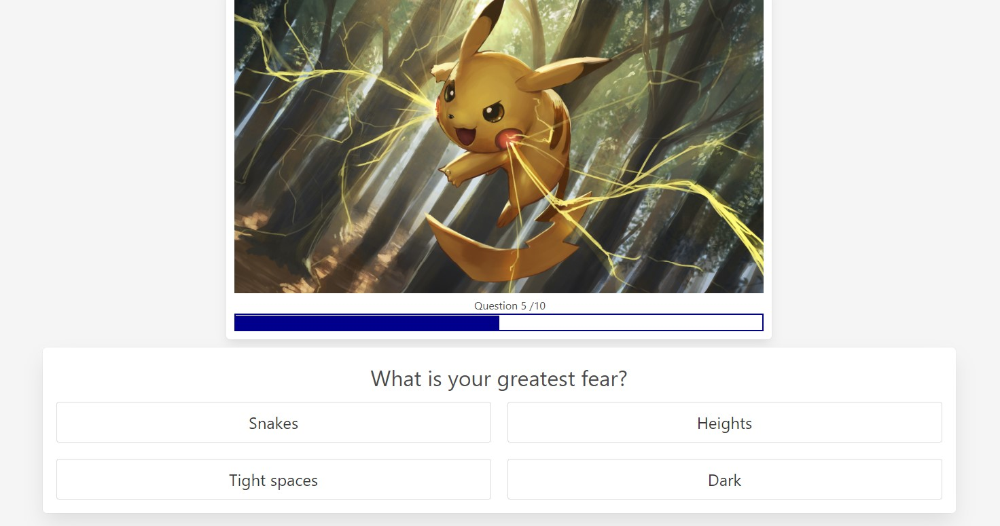

# Buuzz Feed Quiz

## Description
This quiz was created to have fun and build something lighthearted for others to enjoy when they were bored and browsing the web, or were looking for something to do. We wanted to be able to implement some of the logic we have learned and to be able to better understand it. The quiz allows the user to answer some simple questions in order to get paired with a character from Pokemon or Disney.

## Technology
####	Bulma Framework
####	Pokemon API
####	Disney API

## Quiz Steps
1.	Click the “Start” button to begin with the questions.
2.	Answer and click through the 10 questions.
3.	Click the “Results” button to see which character has been selected for you.
4.	Below you can also see previous results if you have played it before.

## Credits
Jacob Aston - @Jacob-Aston
Marcus Goodwin- @marcusgoodwin
Chad Spilker- @RainbowToad
Paige Wing- @PaigeWing

## Links
Live Page: https://jacob-aston.github.io/buuzz-quiz/
Repo: https://github.com/Jacob-Aston/buuzz-quiz

